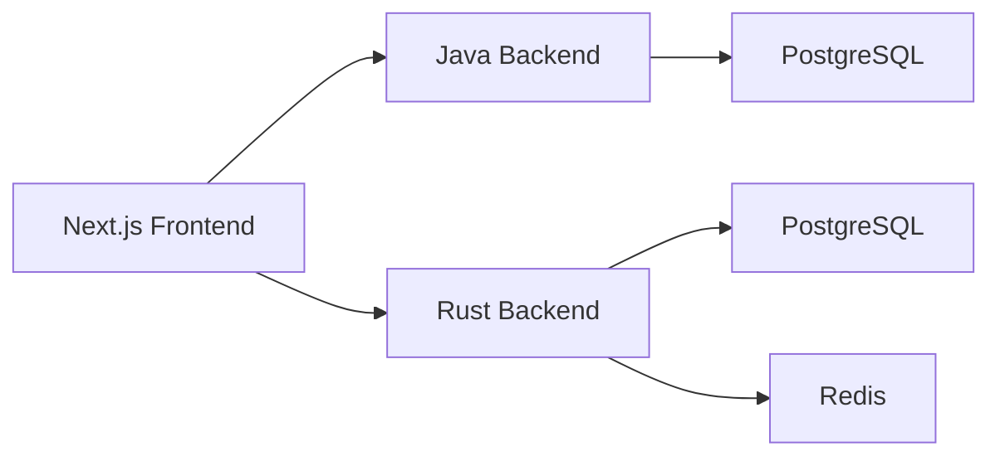
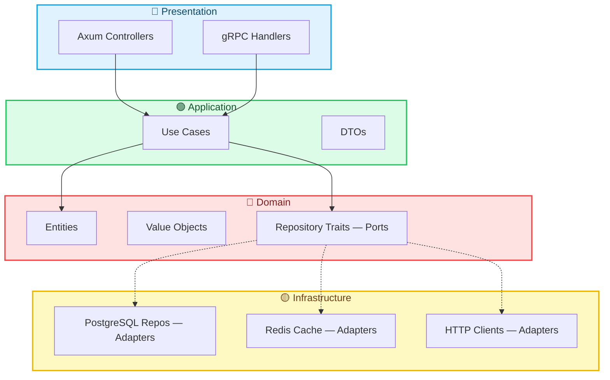

## Overview

This section documents the key architectural decisions that shaped the Yomu platform. Each decision reflects our balance between technical excellence, team capability, and product goals.

## Core Architectural Decision

:::callout[type=note]
We chose a **polyglot microservices** architecture — not a monolith, and not pure microservices with message queues.
:::

This decision balances several competing needs:

| Factor | Monolith | Polyglot Microservices | Pure Microservices |
|--------|----------|------------------------|-------------------|
| Development speed | Fast | Medium | Slow |
| Team scaling | Hard | Easy | Complex |
| Deployment simplicity | Simple | Medium | Complex |
| Performance | Good | Very Good | Best |
| Operational overhead | Low | Medium | High |

### Why Polyglot Microservices?

Yomu's backend is split into specialized services, each optimized for its workload:



**The Java backend** handles authentication, user management, and content operations — heavy business logic with complex relational requirements.

**The Rust backend** handles gamification (leaderboards, achievements), clans, and real-time score updates — high-performance operations requiring low latency and high concurrency.

### Why Not Pure Microservices with Message Queues?

Full microservices with Kafka/RabbitMQ introduce significant operational complexity:

- Message queue infrastructure maintenance
- Handling idempotency and duplicate delivery
- Debugging async flows across services
- Event schema versioning and migrations

For our team size and product stage, the **outbox pattern** provides sufficient consistency without the operational overhead.

### How Services Communicate


## Architecture Style

### Why Two Different Architectures?

Yomu intentionally uses **different architectural patterns** for its two backends. This is not inconsistency — it is a **contextual decision** based on language capabilities, framework conventions, and domain complexity.

### Rust: Clean Architecture (Hexagonal / Ports & Adapters)

Each Rust module follows [Clean Architecture](/docs/design-architecture/clean-architecture) with four strictly separated layers:



**The Rust backend handles gamification logic** — a domain with complex business rules: achievement milestones, mission completion chains, clan score calculations, tier progression, and leaderboard ranking. Clean Architecture isolates these rules from Axum, SQLx, and Redis, making the domain:

- **Testable without a database** — mock repository traits with `mockall`
- **Framework-agnostic** — replace Axum with Actix-web without touching business logic
- **Compiler-enforced** — Rust's visibility rules (`pub(crate)`, module boundaries) make it physically impossible for domain code to import `sqlx` or `axum`

```rust
// Domain knows NOTHING about HTTP, SQL, or JSON
pub struct Clan {
    id: Uuid,
    name: ClanName,        // Value object — validated
    leader_id: Uuid,
    created_at: DateTime<Utc>,
}
```

The cost is **verbosity**: every feature requires a trait (port), an implementation (adapter), a use case, a DTO, and a controller. For Yomu's high-performance gamification engine, this overhead is justified by the correctness guarantees and testability.

Read the full [Clean Architecture deep-dive](/docs/design-architecture/clean-architecture) for theoretical foundations, the Dependency Rule, and why Rust's type system makes Clean Architecture mechanically enforceable.

### Java: Layered Architecture (Controller → Service → Repository)

Java follows a [Layered Architecture](/docs/design-architecture/layered) with Spring Boot's conventional MVC structure:

```
src/
├── main/java/com/yomu/
│   ├── auth/        # Controllers, services, repositories
│   ├── user/        # User management
│   ├── bacaankuis/  # Articles and quizzes
│   ├── forum/       # Comments and discussions
│   ├── outbox/      # Event synchronization
│   └── security/    # JWT, OAuth, filters
```

**The Java backend handles authentication and content CRUD** — domains dominated by framework integration (Spring Security, JPA/Hibernate, OAuth2) rather than complex algorithmic logic. Layered Architecture leverages Spring Boot's strengths:

- **Spring Data JPA** auto-generates repositories from interfaces — zero boilerplate
- **`@Transactional`** wraps service methods with AOP proxies for atomicity
- **Bean Validation** (`@Valid`, `@Email`, `@NotNull`) integrates with controllers
- **Team familiarity** — most Spring developers know Controller-Service-Repository

```java
// Entity doubles as domain model AND persistence schema
@Entity
public class User {
    @Id @GeneratedValue(strategy = GenerationType.UUID)
    private UUID userId;

    @Column(nullable = false, unique = true)
    private String username;

    @Column(nullable = false)
    @Enumerated(EnumType.STRING)
    private Role role = Role.PELAJAR;
}
```

Attempting Clean Architecture in Java would mean **fighting the framework**: duplicating entities (JPA Entity + Domain Entity + Mapper), manually wiring transactions instead of `@Transactional`, and losing lazy loading, dirty checking, and second-level cache.

The trade-off is **coupling**: JPA annotations live on entities, services depend on Spring's IoC container, and repositories are framework-generated. For Yomu's Java domain — which is CRUD-heavy with straightforward rules — this coupling is acceptable.

Read the full [Layered Architecture deep-dive](/docs/design-architecture/layered) for theoretical foundations, framework synergy, and when Layered Architecture breaks down.

### The Comparison

| Dimension | Rust Clean Architecture | Java Layered Architecture |
|-----------|------------------------|---------------------------|
| **Primary concern** | Complex domain logic isolation | Framework integration velocity |
| **Domain complexity** | High (achievements, missions, scoring) | Medium (CRUD, auth flows) |
| **Framework coupling** | Zero — domain is framework-agnostic | High — entities use JPA annotations |
| **Test speed** | Microseconds (no DB needed) | Seconds (Spring context or Mockito) |
| **Compiler enforcement** | Absolute — cannot import sqlx in domain | None — convention-based |
| **Boilerplate** | High (traits, DTOs, mappers) | Low (Spring generates repositories) |
| **Team onboarding** | Slow (Rust + architecture training) | Fast (standard Spring knowledge) |
| **Best for** | Algorithmic, performance-critical domains | CRUD-heavy, standard enterprise apps |

### Why Not Unify on One Architecture?

We evaluated using the same architecture for both backends and rejected it:

**Option A: Clean Architecture in both**
- Java would lose Spring Data JPA, `@Transactional`, and lazy loading
- Massive boilerplate for simple CRUD (duplicate entities, manual SQL, manual mapping)
- Team retraining required
- **Verdict**: Over-engineering for Java's domain

**Option B: Layered Architecture in both**
- Rust would lose compiler-enforced boundaries
- Business logic would leak into Axum controllers and SQLx queries
- Testing would require PostgreSQL + Redis for every unit test
- **Verdict**: Under-engineering for Rust's domain

**Option C: Contextual architecture (chosen)**
- Rust gets strict boundaries for complex gamification logic
- Java gets velocity for standard auth/content CRUD
- Each backend optimized for its language ecosystem
- **Verdict**: Pragmatic polyglot architecture

## Decision Matrix

### Decision: Polyglot Microservices

| Decision | Rationale | Alternatives Considered | Pros | Cons |
|----------|-----------|------------------------|------|------|
| Polyglot (Java + Rust) | Optimize each service for its workload | Single language microservices | Best performance for gamification, mature ecosystem for auth | Deployment complexity, inter-service calls |
| Service-based (not pure microservices) | Minimal messaging infrastructure | Kafka/RabbitMQ | Simpler operations, outbox pattern for consistency | Eventual consistency window |
| Clean Architecture (Rust only) | Testability, maintainability, layer separation for complex gamification logic | Layered architecture for Rust | Domain logic isolated, compiler-enforced boundaries, easy to mock | High boilerplate: traits + DTOs + mappers per feature |
| BFF Pattern (Next.js API) | Hide backend complexity from frontend | Direct frontend → backend calls | Centralized auth, response formatting, caching | Extra hop, Next.js server load |

## Sub-Pages

- [Technology Choices](/docs/design-decisions/technology-choices) — Why Java, Rust, Next.js, PostgreSQL, Redis
- [Design Patterns](/docs/design-decisions/patterns) — Repository, Use Case, Factory, Outbox, and more
