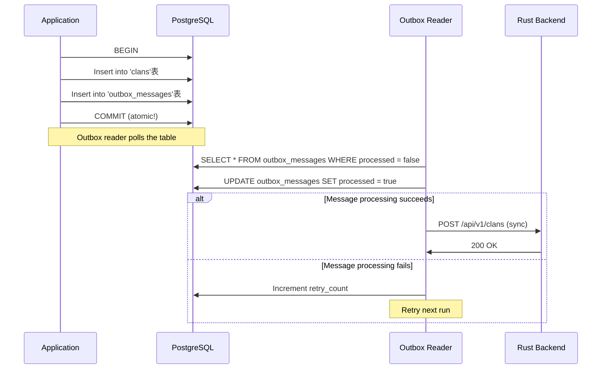
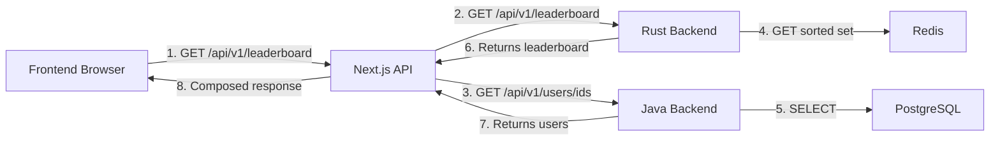

## Repository Pattern

### Where

- **Rust**: All modules (`gamification`, `league`, `user_sync`) have `domain/repositories.rs`
- **Java**: `src/main/java/yomu/auth/repository/`, `src/main/java/yomu/outbox/repository/`

### Why This Pattern

The repository pattern abstracts data access behind an interface, enabling:

| Benefit | Explanation |
|---------|-------------|
| Testability | Mock repositories for unit tests (no real DB) |
| Flexibility | Switch databases or add caching without changing business logic |
| Separation of Concerns | Domain layer doesn't know about SQL or ORMs |

### Rust Code Example

```rust
// domain/repositories.rs
#[async_trait]
pub trait ClanRepository: Send + Sync {
    async fn create(&self, clan: &Clan) -> Result<(), Box<dyn Error + Send + Sync>>;
    async fn find_by_id(&self, id: Uuid) -> Result<Option<Clan>, Box<dyn Error + Send + Sync>>;
    async fn update(&self, clan: &Clan) -> Result<(), Box<dyn Error + Send + Sync>>;
    async fn delete(&self, id: Uuid) -> Result<(), Box<dyn Error + Send + Sync>>;
}

// infrastructure/repositories/postgres_clan_repository.rs
pub struct PostgresClanRepository {
    pool: PGPool,
    cache: RedisCache,
}

#[async_trait]
impl ClanRepository for PostgresClanRepository {
    async fn create(&self, clan: &Clan) -> Result<(), Box<dyn Error + Send + Sync>> {
        sqlx::query!(
            r#"INSERT INTO clans (id, name, description, owner_id, created_at)
               VALUES ($1, $2, $3, $4, $5)"#,
            clan.id,
            clan.name,
            clan.description,
            clan.owner_id,
            clan.created_at
        )
        .execute(&self.pool)
        .await?;

        // Update cache
        self.cache.set_clan(clan).await?;

        Ok(())
    }

    async fn find_by_id(&self, id: Uuid) -> Result<Option<Clan>, Box<dyn Error + Send + Sync>> {
        // Try cache first (fast path)
        if let Some(cache_clan) = self.cache.get_clan(id).await? {
            return Ok(Some(cache_clan));
        }

        // Fallback to database
        let row = sqlx::query!(
            r#"SELECT id, name, description, owner_id, created_at FROM clans WHERE id = $1"#,
            id
        )
        .fetch_optional(&self.pool)
        .await?;

       Ok(row.map(|r| Clan {
            id: r.id,
            name: r.name,
            description: r.description,
            owner_id: r.owner_id,
            created_at: r.created_at,
        }))
    }
}
```

### Java Code Example

```java
// Repository interface (domain layer)
public interface ClanRepository {
    Mono<Clan> save(Clans clan);
    Mono<Clan> findById(UUID id);
    Mono<Void> deleteById(UUID id);
}

// Implementation (infrastructure layer)
@Repository
public class ClanRepositoryImpl implements ClanRepository {
    private final JdbcTemplate jdbcTemplate;
    private final OutboxRepository outboxRepository;

    @Autowired
    public ClanRepositoryImpl(JdbcTemplate jdbcTemplate, OutboxRepository outboxRepository) {
        this.jdbcTemplate = jdbcTemplate;
        this.outboxRepository = outboxRepository;
    }

    @Override
    public Mono<Clan> save(Clan clan) {
        return Mono.fromCallable(() -> {
           _keyValueHolder.set("id", clan.getId().toString());
            keyValueHolder.set("name", clan.getName());
            keyValueHolder.set("description", clan.getDescription());
            keyValueHolder.set("ownerId", clan.getOwnerId().toString());

            jdbcTemplate.update(
                "INSERT INTO clans (id, name, description, owner_id) VALUES (:id, :name, :description, :ownerId)",
                keyValueHolder
            );

            return clan;
        }).subscribeOn(Schedulers.boundedElastic());
    }

    @Override
    public Mono<Clan> findById(UUID id) {
        return Mono.fromCallable(() -> jdbcTemplate.queryForObject(
                "SELECT id, name, description, owner_id, created_at FROM clans WHERE id = ?",
                new BeanPropertyRowMapper<>(Clan.class),
                id
            ))
            .subscribeOn(Schedulers.boundedElastic());
    }
}
```

---

## Use Case / Interactor Pattern

### Where

- **Rust**: `application/use_cases/` in each module
- **Java**: `src/main/java/yomu/auth/application/`, `src/main/java/yomu/outbox/application/`

### Why This Pattern

The use case pattern isolates business logic:

| Benefit | Explanation |
|---------|-------------|
| Single Responsibility | Each use case has one reason to change |
| Testability | Business logic testable without HTTP or DB |
| Composition | Use cases can be composed for complex workflows |
| Separation | Domain layer stays pure (no HTTP or DB dependencies) |

### Rust Code Example

```rust
// application/use_cases/leaderboard/refresh_leaderboard.rs
use crate::domain::repositories::{ClanRepository, ScoreRepository};
use crate::shared::domain::base_error::DomainError;

pub struct RefreshLeaderboardUseCase<R: ClanRepository + ScoreRepository> {
    clan_repo: R,
    score_repo: R,
}

impl<R: ClanRepository + ScoreRepository> RefreshLeaderboardUseCase<R> {
    pub fn new(clan_repo: R, score_repo: R) -> Self {
        Self { clan_repo, score_repo }
    }

    pub async fn execute(&self) -> Result<(), DomainError> {
        // 1. Fetch all clans
        let clans = self.clan_repo.find_all().await?;

        // 2. Calculate total scores for each clan
        let clan_scores: Vec<(Uuid, i64)> = clans
            .iter()
            .map(|clan| (clan.id, self.score_repo.get_total_score(clan.id).await.unwrap_or(0)))
            .collect();

        // 3. Update Redis leaderboard
        for (clan_id, score) in clan_scores.iter() {
            self.score_repo.update_leaderboard(*clan_id, *score).await?;
        }

        Ok(())
    }
}

#[cfg(test)]
mod tests {
    use super::*;
    use mockall::predicate::*;

    #[tokio::test]
    async fn test_refresh_leaderboard() {
        let mut mock_clan_repo = MockClanRepository::new();
        let mut mock_score_repo = MockScoreRepository::new();

        mock_clan_repo
            .expect_find_all()
            .returning(|| Ok(vec![Clan::new(1, "Test Clan", "Description", Uuid::new_v4())]));

        mock_score_repo
            .expect_get_total_score()
            .returning(|_| Ok(1000));

        mock_score_repo
            .expect_update_leaderboard()
            .returning(|_, _| Ok(()));

        let use_case = RefreshLeaderboardUseCase::new(mock_clan_repo, mock_score_repo);
        use_case.execute().await.unwrap();
    }
}
```

### Java Code Example

```java
// Use case with dependency injection
@Service
public class RefreshLeaderboardService {

    private final ClanRepository clanRepository;
    private final ScoreRepository scoreRepository;

    @Autowired
    public RefreshLeaderboardService(
        ClanRepository clanRepository,
        ScoreRepository scoreRepository
    ) {
        this.clanRepository = clanRepository;
        this.scoreRepository = scoreRepository;
    }

    @Transactional
    public void execute() {
        // 1. Fetch all clans
        List<Clan> clans = clanRepository.findAll();

        // 2. Calculate total scores
        Map<UUID, Long> clanScores = clans.stream()
            .collect(Collectors.toMap(
                Clan::getId,
                clan -> scoreRepository.getTotalScore(clan.getId())
            ));

        // 3. Update Redis (via external service)
        clanScores.forEach((clanId, score) -> {
            try {
                scoreRepository.updateLeaderboard(clanId, score);
            } catch (Exception e) {
                // Log error, continue with其他 clans
                log.error("Failed to update leaderboard for clan {}", clanId, e);
            }
        });
    }
}

// Repository interface (domain layer)
public interface ScoreRepository {
    Long getTotalScore(UUID clanId);
    void updateLeaderboard(UUID clanId, Long score);
}

// Implementation (infrastructure layer)
@Repository
public class ScoreRepositoryImpl implements ScoreRepository {

    private final RedisTemplate<String, Object> redisTemplate;
    private final JdbcTemplate jdbcTemplate;

    @Autowired
    public ScoreRepositoryImpl(RedisTemplate<String, Object> redisTemplate, JdbcTemplate jdbcTemplate) {
        this.redisTemplate = redisTemplate;
        this.jdbcTemplate = jdbcTemplate;
    }

    @Override
    public Long getTotalScore(UUID clanId) {
        // Query score from PostgreSQL
        return jdbcTemplate.queryForObject(
            "SELECT COALESCE(SUM(score), 0) FROM scores WHERE clan_id = ?",
            Long.class,
            clanId
        );
    }

    @Override
    public void updateLeaderboard(UUID clanId, Long score) {
        // Update Redis sorted set
        redisTemplate.opsForZSet().add("leaderboard", clanId.toString(), score);
    }
}
```

---

## Factory Pattern

### Where

- **Rust**: `domain/entities/` — constructors like `Clan::new()`, `Clan::with_id()`

### Why This Pattern

The factory pattern encapsulates creation logic:

| Benefit | Explanation |
|---------|-------------|
| Validation | Enforce invariants at creation time |
| Centralization | Single source of truth for object creation |
| Testability | Mock factories for testing |

### Rust Code Example

```rust
// domain/entities/clan.rs
use std::error::Error;
use uuid::Uuid;
use crate::domain::entities::errors::ClanError;

pub struct Clan {
    id: Uuid,
    name: String,
    description: Option<String>,
    owner_id: Uuid,
    created_at: chrono::DateTime<chrono::Utc>,
}

impl Clan {
    /// Creates a new clan with validation
    pub fn new(name: String, description: Option<String>, owner_id: Uuid) -> Result<Self, ClanError> {
        if name.trim().is_empty() {
            return Err(ClanError::InvalidName("Name cannot be empty".to_string()));
        }

        if name.len() > 50 {
            return Err(ClanError::InvalidName("Name cannot exceed 50 characters".to_string()));
        }

        let clan = Self {
            id: Uuid::new_v4(),
            name,
            description,
            owner_id,
            created_at: chrono::Utc::now(),
        };

        Ok(clan)
    }

    /// Creates a clan with existing ID (for loading from database)
    pub fn with_id(id: Uuid, name: String, description: Option<String>, owner_id: Uuid, created_at: chrono::DateTime<chrono::Utc>) -> Self {
        Self {
            id,
            name,
            description,
            owner_id,
            created_at,
        }
    }

    // Getters...
    pub fn id(&self) -> Uuid { self.id }
    pub fn name(&self) -> &str { &self.name }
    pub fn description(&self) -> &Option<String> { &self.description }
    pub fn owner_id(&self) -> Uuid { self.owner_id }
    pub fn created_at(&self) -> chrono::DateTime<chrono::Utc> { self.created_at }
}
```

### Benefits

- Validation happens once at creation
- Invariants are guaranteed (no empty names, names ≤ 50 chars)
- Database loading (`with_id`) bypasses validation (trusts DB)

---

## Strategy Pattern

### Where

- **Java**: `src/main/java/yomu/auth/application/strategy/` — ReactionStrategy + implementations

### Why This Pattern

The strategy pattern enables extensible behavior:

| Benefit | Explanation |
|---------|-------------|
| Open/Closed | New strategies without modifying existing code |
| Testability | Each strategy testable in isolation |
| Configuration | Select strategy at runtime |

### Java Code Example

```java
// Strategy interface
public interface ReactionStrategy {
    ReactionResponse react(ReactionRequest request);
    boolean supports(ReactionType type);
}

// Concrete strategy: Upvote
@Component
public class UpvoteReactionStrategy implements ReactionStrategy {

    private final ReactionRepository reactionRepository;

    @Autowired
    public UpvoteReactionStrategy(ReactionRepository reactionRepository) {
        this.reactionRepository = reactionRepository;
    }

    @Override
    public ReactionResponse react(ReactionRequest request) {
        // Upvote logic: increment score, update leaderboard
        reactionRepository.incrementScore(request.getAuthorId(), request.getPostId(), 1);

        return new ReactionResponse(
            true,
            "Upvote recorded",
            reactionRepository.getScore(request.getPostId())
        );
    }

    @Override
    public boolean supports(ReactionType type) {
        return type == ReactionType.UPVOTE;
    }
}

// Strategy factory
@Component
public class ReactionStrategyFactory {

    private final List<ReactionStrategy> strategies;

    @Autowired
    public ReactionStrategyFactory(List<ReactionStrategy> strategies) {
        this.strategies = strategies;
    }

    public ReactionStrategy getStrategy(ReactionType type) {
        return strategies.stream()
            .filter(s -> s.supports(type))
            .findFirst()
            .orElseThrow(() -> new IllegalArgumentException("No strategy for type: " + type));
    }
}

// Controller uses strategy
@RestController
public class ReactionController {

    private final ReactionStrategyFactory strategyFactory;

    @Autowired
    public ReactionController(ReactionStrategyFactory strategyFactory) {
        this.strategyFactory = strategyFactory;
    }

    @PostMapping("/api/v1/reactions")
    public ResponseEntity<ApiResponse<ReactionResponse>> react(@RequestBody ReactionRequest request) {
        ReactionStrategy strategy = strategyFactory.getStrategy(request.getType());
        ReactionResponse response = strategy.react(request);

        return ResponseEntity.ok(ApiResponse.success("Reaction processed", response));
    }
}
```

### Benefits

- Adding new reaction types doesn't modify existing code
- Strategy selection happens at runtime
- Each strategy is testable in isolation

---

## Outbox Pattern

### Where

- **Java**: `src/main/java/yomu/outbox/` — outbox message handling

### Why This Pattern

The outbox pattern ensures eventual consistency:

| Benefit | Explanation |
|---------|-------------|
| Atomic writes | Database transaction includes both business data and outbox message |
| No message queue required | Simple database table for message delivery |
| Retry mechanism | Failed messages can be re-processed |

### Flow Diagram



### Java Code Example

```java
// Outbox message entity
@Entity
@Table(name = "outbox_messages")
public class OutboxMessage {

    @Id
    @GeneratedValue(strategy = GenerationType.IDENTITY)
    private Long id;

    private String exchange;
    private String routingKey;
    private String payload;
    private Integer retryCount = 0;
    private Boolean processed = false;
    private LocalDateTime createdAt = LocalDateTime.now();

    // Getters, setters...
}

// Repository
public interface OutboxMessageRepository extends JpaRepository<OutboxMessage, Long> {
    @Query("SELECT m FROM OutboxMessage m WHERE m.processed = false ORDER BY m.createdAt ASC LIMIT :limit")
    List<OutboxMessage> findUnprocessed(@Param("limit") int limit);
}

// Service writes to outbox (same transaction)
@Service
public class ClanService {

    private final JdbcTemplate jdbcTemplate;
    private final OutboxMessageRepository outboxRepository;

    @Transactional
    public void createClan(Clan clan) {
        // 1. Insert clan
        jdbcTemplate.update(
            "INSERT INTO clans (id, name, description, owner_id) VALUES (?, ?, ?, ?)",
            clan.getId().toString(),
            clan.getName(),
            clan.getDescription(),
            clan.getOwnerId().toString()
        );

        // 2. Insert outbox message (same transaction!)
        OutboxMessage message = new OutboxMessage();
        message.setExchange("yomu.gamification");
        message.setRoutingKey("clan.created");
        message.setPayload(new ObjectMapper().writeValueAsString(clan));
        message.setProcessed(false);

        outboxRepository.save(message);

        // Both operations are in the same transaction
        // If either fails, both are rolled back
    }
}

// Outbox reader job (runs periodically)
@Component
public class OutboxMessageReader {

    private static final int BATCH_SIZE = 100;

    private final OutboxMessageRepository outboxRepository;
    private final RestTemplate restTemplate;

    @Scheduled(fixedDelay = 5000) // Run every 5 seconds
    public void processOutboxMessages() {
        List<OutboxMessage> messages = outboxRepository.findUnprocessed(BATCH_SIZE);

        for (OutboxMessage message : messages) {
            try {
                // Send message to Rust backend
                HttpHeaders headers = new HttpHeaders();
                headers.setContentType(MediaType.APPLICATION_JSON);
                headers.set("X-API-Key", System.getenv("INTERNAL_API_KEY"));

                HttpEntity<String> entity = new HttpEntity<>(message.getPayload(), headers);
                restTemplate.postForObject(
                    System.getenv("RUST_ENGINE_BASE_URL") + "/api/v1/sync/clan",
                    entity,
                    Void.class
                );

                // Mark message as processed
                message.setProcessed(true);
                outboxRepository.save(message);

                log.info("Successfully processed outbox message: {}", message.getId());

            } catch (Exception e) {
                // Increment retry count
                message.setRetryCount(message.getRetryCount() + 1);
                outboxRepository.save(message);

                log.error("Failed to process outbox message: {}", message.getId(), e);
            }
        }
    }
}
```

### Benefits

- No message queue infrastructure required
- Transactional consistency (both business data and outbox message in one transaction)
- Retry mechanism built-in
- Simple to implement and debug

---

## Hexagonal / Ports & Adapters

### Where

- **Rust**: `domain/`, `infrastructure/`, `presentation/` per module — fully implements Hexagonal Architecture with Ports & Adapters
- **Java**: Uses conventional **Layered Architecture** (Controller → Service → Repository) via Spring Boot. Hexagonal Architecture concepts are not strictly enforced in the Java codebase.

### Why This Pattern

Hexagonal architecture isolates domain logic:

| Benefit | Explanation |
|---------|-------------|
| Domain isolation | Business logic testable without HTTP or DB |
| Swappable adapters | Switch from SQLx to Diesel, or from HTTP to gRPC |
| Testability | Mock adapters for unit tests |

### Layer Diagram

```
┌─────────────────────────────────┐
│   presentation/                 │  ← Handlers, DTOs, OpenAPI
│   - ClanHandler                 │
│   - ClanCreateRequest           │
└──────────┬──────────────────────┘
           │
           ▼
┌─────────────────────────────────┐
│   application/use_cases/        │  ← Business logic
│   - ClanCreateUseCase           │
│   - ClanGetUseCase              │
└──────────┬──────────────────────┘
           │
           ▼
┌─────────────────────────────────┐
│   domain/                       │  ← Entities, repositories (interfaces)
│   - Clan (entity)               │
│   - ClanRepository (trait)      │
└──────────┬──────────────────────┘
           │
           ▼
┌─────────────────────────────────┐
│   infrastructure/               │  ← Adapters: DB, Redis, HTTP
│   - PostgresClanRepository      │
│   - RedisCache                  │
└─────────────────────────────────┘
```

### Rust Code Example

```rust
// domain/entities/clan.rs
#[derive(Debug, Clone, Serialize, Deserialize)]
pub struct Clan {
    pub id: Uuid,
    pub name: String,
    pub description: Option<String>,
    pub owner_id: Uuid,
    pub created_at: chrono::DateTime<chrono::Utc>,
}

// domain/repositories.rs
#[async_trait]
pub trait ClanRepository: Send + Sync {
    async fn create(&self, clan: &Clan) -> Result<(), Box<dyn Error + Send + Sync>>;
    async fn find_by_id(&self, id: Uuid) -> Result<Option<Clan>, Box<dyn Error + Send + Sync>>;
    // ... other methods
}

// domain/use_cases/clan_create.rs
use crate::domain::repositories::ClanRepository;

pub struct ClanCreateUseCase<R: ClanRepository> {
    repository: R,
}

impl<R: ClanRepository> ClanCreateUseCase<R> {
    pub fn new(repository: R) -> Self {
        Self { repository }
    }

    pub async fn execute(&self, name: String, description: Option<String>, owner_id: Uuid) -> Result<Uuid, Box<dyn Error + Send + Sync>> {
        let clan = Clan::new(name, description, owner_id)?;

        self.repository.create(&clan).await?;

        Ok(clan.id)
    }
}

// infrastructure/repositories/postgres_clan_repository.rs
use crate::domain::repositories::ClanRepository;
use crate::domain::entities::Clan;

pub struct PostgresClanRepository {
    pool: PGPool,
}

impl PostgresClanRepository {
    pub fn new(pool: PGPool) -> Self {
        Self { pool }
    }
}

#[async_trait]
impl ClanRepository for PostgresClanRepository {
    async fn create(&self, clan: &Clan) -> Result<(), Box<dyn Error + Send + Sync>> {
        sqlx::query!(
            r#"INSERT INTO clans (id, name, description, owner_id, created_at)
               VALUES ($1, $2, $3, $4, $5)"#,
            clan.id,
            clan.name,
            clan.description,
            clan.owner_id,
            clan.created_at
        )
        .execute(&self.pool)
        .await?;

        Ok(())
    }

    // ... other implements
}

// presentation/handlers.rs
use crate::application::use_cases::clan_create::ClanCreateUseCase;
use crate::infrastructure::repositories::postgres_clan_repository::PostgresClanRepository;
use crate::domain::repositories::ClanRepository;
use axum::{extract::State, Json};

pub async fn create_clan(
    State(repo): State<PostgresClanRepository>,
    Json(request): Json<ClanCreateRequest>,
) -> impl IntoResponse {
    let use_case = ClanCreateUseCase::new(repo);
    let clan_id = use_case.execute(request.name, request.description, request.owner_id).await?;

    Json(serde_json::json!({
        "success": true,
        "message": "Clan created",
        "data": { "id": clan_id }
    }))
}
```

### Benefits

- Domain logic is pure (no SQL, no HTTP)
- Easy to swap infrastructure (PostgreSQL → Redis, HTTP → gRPC)
- Testable without running services (mock repositories)

---

## BFF / Backend-for-Frontend

### Where

- **Next.js**: `src/app/api/v1/` route handlers

### Why This Pattern

The BFF pattern hides backend complexity:

| Benefit | Explanation |
|---------|-------------|
| Single source of truth | API routes manage data composition |
| Shared authentication | HTTP-only cookies managed by Next.js |
| Response formatting | Consistent `{"success", "message", "data"}` format |
| Error handling | Centralized error transformation |

### Diagram



### Next.js Code Example

```typescript
// src/app/api/v1/leaderboard/route.ts
import { NextResponse } from 'next/server';
import { cookies } from 'next/headers';
import { getBearerToken } from '@/lib/server/auth';
import { createResponse } from '@/lib/server/coreProxy';

export async function GET(request: Request) {
  try {
    // 1. Get auth token from cookie
    const cookieStore = cookies();
    const token = cookieStore.get('yomu_access_token')?.value;

    if (!token) {
      return NextResponse.json(
        { success: false, message: 'Unauthorized', data: null },
        { status: 401 }
      );
    }

    // 2. Call Rust backend for leaderboard data
    const rustUrl = new URL('/api/v1/leaderboard', process.env.RUST_ENGINE_URL!);
    const rustResponse = await fetch(rustUrl.toString(), {
      headers: {
        Authorization: `Bearer ${token}`,
        'Content-Type': 'application/json',
      },
    });

    if (!rustResponse.ok) {
      const rustError = await rustResponse.json();
      return NextResponse.json(
        { success: false, message: rustError.message, data: null },
        { status: rustResponse.status }
      );
    }

    const rustData = await rustResponse.json();

    // 3. Extract user IDs to fetch names from Java backend
    const userIds = rustData.data.scores.map((s: any) => s.userId);
    const uniqueUserIds = [...new Set(userIds)];

    // 4. Call Java backend for user details
    const javaUrl = new URL('/api/v1/users', process.env.CORE_API_BASE_URL!);
    const javaResponse = await fetch(
      `${javaUrl.toString()}?ids=${uniqueUserIds.join(',')}`,
      {
        headers: {
          Authorization: `Bearer ${token}`,
          'X-API-Key': process.env.INTERNAL_API_KEY!,
        },
      }
    );

    if (!javaResponse.ok) {
      const javaError = await javaResponse.json();
      return NextResponse.json(
        { success: false, message: javaError.message, data: null },
        { status: javaResponse.status }
      );
    }

    const javaData = await javaResponse.json();

    // 5. Compose response: merge leaderboard with user data
    const userMap = new Map(javaData.data.map((u: any) => [u.id, u]));

    const composedScores = rustData.data.scores.map((s: any) => ({
      ...s,
      user: userMap.get(s.userId) || { id: s.userId, name: 'Unknown', avatar: null },
    }));

    // 6. Return composed response
    return NextResponse.json(
      createResponse(
        true,
        'Leaderboard fetched',
        { scores: composedScores, total: rustData.data.total }
      )
    );
  } catch (error: any) {
    return NextResponse.json(
      createResponse(false, error.message || 'Internal server error', null),
      { status: 500 }
    );
  }
}
```

### Benefits

- Frontend makes one request instead of multiple backend calls
- Auth token managed by Next.js (not exposed to browser)
- Response format standardized
- Error handling centralized

---

## API Composition Pattern

### Where

- **Rust gamification + Java auth** — Leaderboard page fetches scores from Rust, user names from Java

### Why This Pattern

API composition avoids backend-to-backend chatter:

| Benefit | Explanation |
|---------|-------------|
| Reduced overhead | Backend services don't call each other |
| Better scalability | Frontend can parallelize requests |
| Simpler scaling | Each service scales independently |

### Rust Code Example

```rust
// Rust backend exposes scores
#[tokio::test]
async fn test_leaderboard_exposes_scores_only() {
    // Rust only returns score IDs and values
    // Does NOT fetch user names (that's Java's responsibility)
    let json = serde_json::json!({
        "success": true,
        "message": "Leaderboard fetched",
        "data": {
            "scores": [
                {"userId": "123e4567-e89b-12d3-a456-426614174000", "score": 3000},
                {"userId": "789e1234-e89b-12d3-a456-426614174890", "score": 2500}
            ],
            "total": 2
        }
    });
}
```

### Next.js BFF Composes Data

```typescript
// Next.js BFF fetches from both backends and composes
const scores = await fetchRustLeaderboard(); // Rust: user IDs + scores
const users = await fetchJavaUsers(scores.map(s => s.userId)); // Java: user details

const composed = scores.map(score => ({
    ...score,
    user: users.find(u => u.id === score.userId) // Composed by Next.js
}));
```

### Benefits

- Rust focus: high-performance score operations
- Java focus: user profile operations
- Next.js focus: composition and caching

---

## DTO Pattern

### Where

- **Rust**: `presentation/dto/` — request/response objects
- **Java**: `src/main/java/yomu/auth/dto/`, `src/main/java/yomu/outbox/dto/`

### Why This Pattern

DTOs decouple API contracts from internal entities:

| Benefit | Explanation |
|---------|-------------|
| Versioning | API changes don't break internal structure |
| Decoupling | Entities can evolve independently |
| Validation | DTOs enforce input validation |

### Rust Code Example

```rust
// presentation/dto/clan_create_request.rs
use serde::{Deserialize, Serialize};
use uuid::Uuid;
use crate::domain::entities::Clan;

#[derive(Debug, Clone, Serialize, Deserialize)]
pub struct ClanCreateRequest {
    pub name: String,
    pub description: Option<String>,
    pub owner_id: Uuid,
}

// From trait converts DTO to entity
impl From<ClanCreateRequest> for Clan {
    fn from(dto: ClanCreateRequest) -> Self {
        Self::new(dto.name, dto.description, dto.owner_id).expect("Invalid clan data")
    }
}

impl Validate for ClanCreateRequest {
    fn validate(&self) -> Result<(), Box<dyn Error + Send + Sync>> {
        if self.name.trim().is_empty() {
            return Err("Name cannot be empty".into());
        }

        if self.name.len() > 50 {
            return Err("Name cannot exceed 50 characters".into());
        }

        Ok(())
    }
}

// presentation/dto/clan_response.rs
#[derive(Debug, Clone, Serialize, Deserialize)]
pub struct ClanResponse {
    pub id: Uuid,
    pub name: String,
    pub description: Option<String>,
    pub owner_id: Uuid,
    pub created_at: String,
}

impl From<Clan> for ClanResponse {
    fn from(clan: Clan) -> Self {
        Self {
            id: clan.id(),
            name: clan.name().to_string(),
            description: clan.description().clone(),
            owner_id: clan.owner_id(),
            created_at: clan.created_at().to_rfc3339(),
        }
    }
}
```

### Benefits

- Internal `Clan` can have methods, validation, invariants
- API-level `ClanResponse` is simple (only fields for JSON)
- Easy to add fields without breaking internal code

---

## Dependency Injection

### Where

- **Rust**: Use case constructors accept repositories as parameters
- **Java**: `@Autowired` constructor injection, `@Service`, `@Component`

### Why This Pattern

DI enables testability and loose coupling:

| Benefit | Explanation |
|---------|-------------|
| Testability | Mock dependencies for unit tests |
| Loose coupling | Components depend on abstractions, not concretions |
| Flexibility | Swap implementations at runtime |

### Rust Code Example

```rust
// Domain interfaces (ports)
pub trait ClanRepository: Send + Sync {
    async fn create(&self, clan: &Clan) -> Result<(), Box<dyn Error + Send + Sync>>;
}

// Infrastructure implementations (adapters)
pub struct PostgresClanRepository {
    pool: PGPool,
}

#[async_trait]
impl ClanRepository for PostgresClanRepository {
    async fn create(&self, clan: &Clan) -> Result<(), Box<dyn Error + Send + Sync>> {
        // PostgreSQL implementation
    }
}

// Use cases (depend on interfaces, not implementations)
pub struct ClanCreateUseCase<R: ClanRepository> {
    repository: R,
}

impl<R: ClanRepository> ClanCreateUseCase<R> {
    pub fn new(repository: R) -> Self {
        Self { repository }
    }

    pub async fn execute(&self, name: String, description: Option<String>, owner_id: Uuid) -> Result<Uuid, Box<dyn Error + Send + Sync>> {
        let clan = Clan::new(name, description, owner_id)?;
        self.repository.create(&clan).await?;
        Ok(clan.id)
    }
}

// Composition root
#[tokio::main]
async fn main() {
    let pool = PGPool::connect("postgres://...").await.unwrap();
    let repo = PostgresClanRepository::new(pool);
    let use_case = ClanCreateUseCase::new(repo);

    let clan_id = use_case.execute("Test Clan".to_string(), None, Uuid::new_v4()).await.unwrap();
    println!("Created clan with ID: {}", clan_id);
}
```

### Java Code Example

```java
// Repository interface (port)
public interface ClanRepository {
    Mono<Clan> save(Clan clan);
}

// Implementation (adapter)
@Repository
public class ClanRepositoryImpl implements ClanRepository {
    private final JdbcTemplate jdbcTemplate;

    @Autowired
    public ClanRepositoryImpl(JdbcTemplate jdbcTemplate) {
        this.jdbcTemplate = jdbcTemplate;
    }

    @Override
    public Mono<Clan> save(Clan clan) {
        // JPA implementation
    }
}

// Use case (depends on interface)
@Service
public class ClanService {

    private final ClanRepository clanRepository;

    @Autowired
    public ClanService(ClanRepository clanRepository) {
        this.clanRepository = clanRepository;
    }

    @Transactional
    public Mono<Clan> createClan(Clan clan) {
        return Mono.fromCallable(() -> clanRepository.save(clan))
            .subscribeOn(Schedulers.boundedElastic());
    }
}
```

### Benefits

- Testable with mocks
- Runtime flexibility (switch implementations)
- Clear dependency graph

---

## Summary

| Pattern | Where | Why |
|---------|-------|-----|
| Repository | All modules | Abstract data access, enable testing |
| Use Case | Rust `application/use_cases/` | Isolate business logic |
| Factory | Rust entities | Encapsulate creation with validation |
| Strategy | Java reactions | Extensible behavior without modification |
| Outbox | Java `outbox/` | Ensure eventual consistency |
| Hexagonal / Ports & Adapters | Rust modules only | Domain logic isolated from infrastructure; Java uses conventional Layered Architecture |
| BFF | Next.js API routes | Hide backend complexity |
| API Composition | Leaderboard page | Avoid backend-to-backend calls |
| DTO | Backends | Decouple API from internal entities |
| DI | Both backends | Enable testing, loose coupling |

These patterns create a maintainable, testable, and high-performance codebase.
