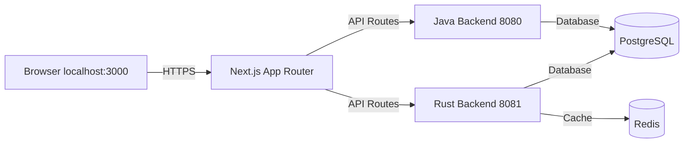

## Gambaran Umum

Panduan ini mencakup cara menyiapkan environment pengembangan lokal untuk Yomu. Platform terdiri dari tiga service:

| Service | Port | Deskripsi |
|---------|------|-------------|
| Frontend | 3000 | Next.js 16 |
| Java Backend | 8080 | Spring Boot 4 |
| Rust Backend | 8081 | Axum 0.8 |



## Struktur Sub-Proyek

### yomu-backend-java

Java 21 dengan Spring Boot 4.0.2, Gradle Kotlin DSL.

```bash
cd yomu-backend-java
./gradlew bootRun
```

### yomu-backend-rust

Rust 1.85+ (Edition 2024), Axum 0.8.8, SQLx.

```bash
cd yomu-backend-rust
cargo run
# atau dengan hot reload:
docker compose -f docker-compose.dev.yml up
```

### yomu-frontend

Next.js 16.1.6, React 19.2.3, Tailwind CSS v4, shadcn/ui.

```bash
cd yomu-frontend
bun run dev
```

## Prasyarat

| Tool | Versi | Catatan |
|------|---------|-------|
| Java | 21 | `java -version` harus menampilkan 21 |
| Rust | 1.85+ | `rustc --version` |
| Node.js | 22+ | `node -v` |
| Docker | Terbaru | Desktop atau Engine |
| bun | Terbaru | `bun -v` |

## Mulai Cepat

### Langkah 1: Mulai Infrastructure

Semua proyek menyertakan Docker Compose untuk PostgreSQL dan Redis.

```bash
# Mulai kedua services (PostgreSQL 16/17, Redis 8)
cd yomu-backend-rust && docker compose -f docker-compose.dev.yml build && docker compose -f docker-compose.dev.yml up -d
```

Verifikasi:

```bash
docker compose -f yomu-backend-rust/docker-compose.dev.yml ps
```

### Langkah 2: Jalankan Migrations

```bash
# Java: auto-migrate saat startup
# Rust: migration manual
cd yomu-backend-rust
cargo sqlx migrate run
```

### Langkah 3: Mulai Java Backend

```bash
cd yomu-backend-java
./gradlew bootRun
```

Verifikasi: `curl http://localhost:8080/health`

### Langkah 4: Mulai Rust Backend

```bash
cd yomu-backend-rust
cargo run
```

Verifikasi: `curl http://localhost:8081/health`

### Langkah 5: Mulai Frontend

```bash
cd yomu-frontend
bun run dev
```

Verifikasi: buka `http://localhost:3000`

---

## Tugas Umum

| Tugas | Command |
|------|---------|
| Jalankan Java tests | `cd yomu-backend-java && ./gradlew test` |
| Jalankan Rust tests | `cd yomu-backend-rust && cargo test` |
| Build frontend | `cd yomu-frontend && bun run build` |
| Format Rust code | `cd yomu-backend-rust && cargo fmt` |
| Lint Rust code | `cd yomu-backend-rust && cargo clippy` |

---

## Sub-Halaman

- [Panduan Setup](/docs/development/setup) — Setup detail dengan environment variables, Docker Compose, dan troubleshooting