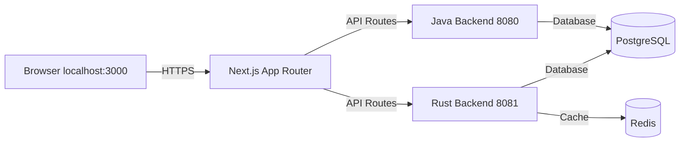

## Overview

This guide covers setting up your local development environment for Yomu. The platform consists of three services:

| Service | Port | Description |
|---------|------|-------------|
| Frontend | 3000 | Next.js 16 |
| Java Backend | 8080 | Spring Boot 4 |
| Rust Backend | 8081 | Axum 0.8 |



## Sub-Projects Structure

### yomu-backend-java

Java 21 with Spring Boot 4.0.2, Gradle Kotlin DSL.

```bash
cd yomu-backend-java
./gradlew bootRun
```

### yomu-backend-rust

Rust 1.85+ (Edition 2024), Axum 0.8.8, SQLx.

```bash
cd yomu-backend-rust
cargo run
# or with hot reload:
docker compose -f docker-compose.dev.yml up
```

### yomu-frontend

Next.js 16.1.6, React 19.2.3, Tailwind CSS v4, shadcn/ui.

```bash
cd yomu-frontend
bun run dev
```

## Prerequisites

| Tool | Version | Notes |
|------|---------|-------|
| Java | 21 | `java -version` must show 21 |
| Rust | 1.85+ | `rustc --version` |
| Node.js | 22+ | `node -v` |
| Docker | Latest | Desktop or Engine |
| bun | Latest | `bun -v` |

## Quick Start

### Step 1: Start Infrastructure

All projects include Docker Compose for PostgreSQL and Redis.

```bash
# Start both services (PostgreSQL 16/17, Redis 8)
cd yomu-backend-rust && docker compose -f docker-compose.dev.yml build && docker compose -f docker-compose.dev.yml up -d
```

Verify:

```bash
docker compose -f yomu-backend-rust/docker-compose.dev.yml ps
```

### Step 2: Run Migrations

```bash
# Java: auto-migrates on startup
# Rust: manual migration
cd yomu-backend-rust
cargo sqlx migrate run
```

### Step 3: Start Java Backend

```bash
cd yomu-backend-java
./gradlew bootRun
```

Verify: `curl http://localhost:8080/health`

### Step 4: Start Rust Backend

```bash
cd yomu-backend-rust
cargo run
```

Verify: `curl http://localhost:8081/health`

### Step 5: Start Frontend

```bash
cd yomu-frontend
bun run dev
```

Verify: open `http://localhost:3000`

---

## Common Tasks

| Task | Command |
|------|---------|
| Run Java tests | `cd yomu-backend-java && ./gradlew test` |
| Run Rust tests | `cd yomu-backend-rust && cargo test` |
| Build frontend | `cd yomu-frontend && bun run build` |
| Format Rust code | `cd yomu-backend-rust && cargo fmt` |
| Lint Rust code | `cd yomu-backend-rust && cargo clippy` |

---

## Sub-Pages

- [Setup Guide](/docs/development/setup) — Detailed setup with environment variables, Docker Compose, and troubleshooting
