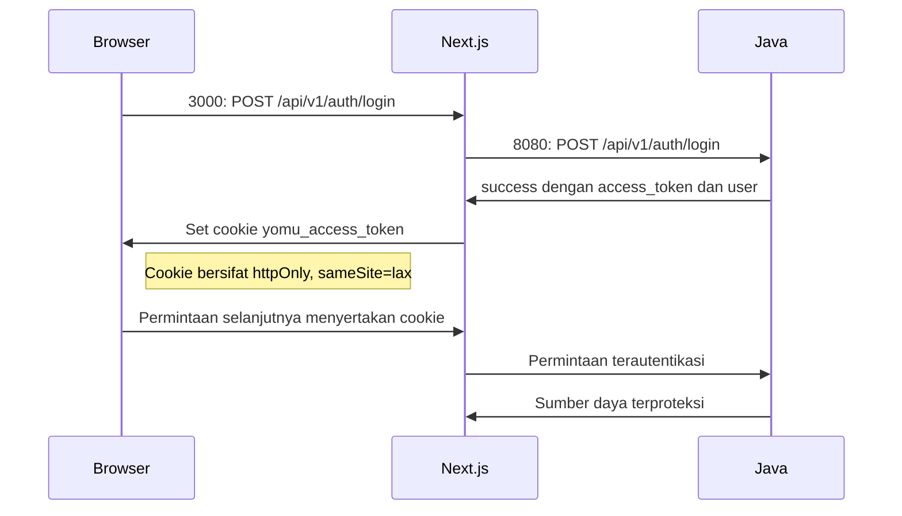
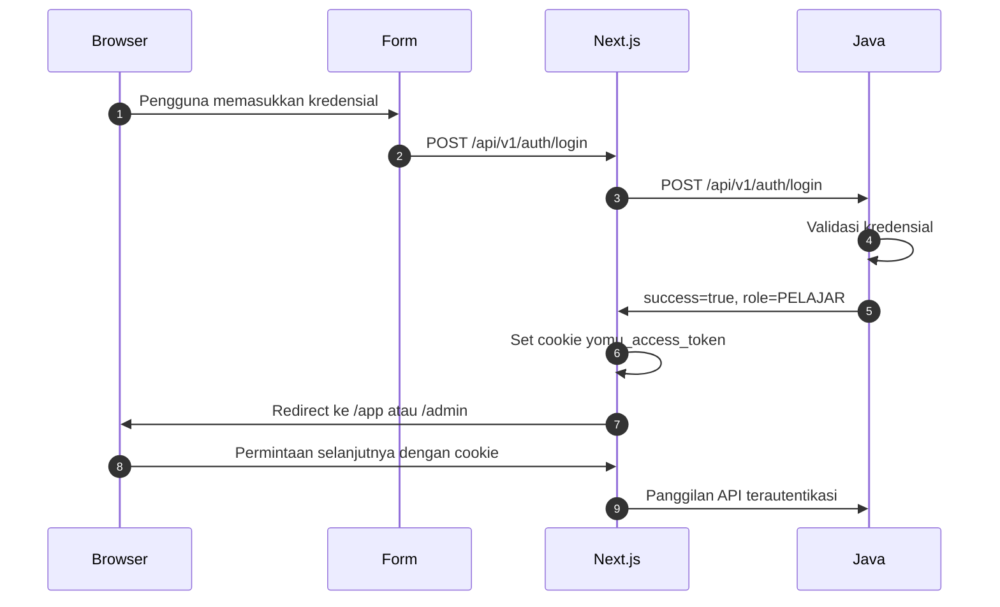

# Autentikasi

Frontend Yomu berkomunikasi langsung dengan backend services. Autentikasi ditangani oleh Java Spring Boot di port 8080, sementara data pengguna diperkaya dari Rust Engine di port 8081 untuk fitur gamifikasi.

## Architecture Autentikasi

Frontend menggunakan route handler Next.js untuk menangani autentikasi. Semua operasi sensitif (seperti handling token OAuth) tetap di sisi server. Pattern ini menyediakan:

- **Keamanan**: Token JWT disimpan dalam HTTP-only cookie, tidak pernah diekspos ke JavaScript
- **Validasi**: Validasi response terpusat melalui `ApiResponse<T>`
- **Manajemen Sesi**: HTTP-only cookie mencegah XSS attacks



## Modul API Inti

### coreFetch.ts

Modul server-only yang menyediakan fondasi untuk semua panggilan API ke backend:

```typescript
// src/lib/server/coreFetch.ts
export async function coreFetch(path: string, init?: RequestInit) {
  const response = await fetch(`${CORE_API_BASE_URL}${path}`, init);
  return await response.json<ApiResponse<T>>();
}
```

**Perilaku utama**:
- Memanggil `CORE_API_BASE_URL${path}` (env variable untuk Java backend)
- Memvalidasi struktur response `ApiResponse<T>`
- Mengembalikan JSON yang sudah diparse dengan field success/message/data

### cookies.ts

Mengelola cookie autentikasi:

- **Nama**: `yomu_access_token`
- **Atribut**: `httpOnly`, `secure`, `sameSite=lax`, `path=/`
- **Tujuan**: Menyimpan token JWT tanpa akses JavaScript

## Alur Autentikasi



## Fungsi API Auth

Lokasi: `src/lib/api/auth.ts`

| Fungsi | Deskripsi |
|----------|-------------|
| `login(email, password)` | Autentikasi email/password |
| `register(user)` | Registrasi pengguna baru |
| `googleLogin(token)` | Autentikasi Google One Tap |
| `me()` | Dapatkan pengguna saat ini (terproteksi) |
| `logout()` | Hapus cookie dan sesi |

## Client Fetcher

Lokasi: `src/lib/api/fetcher.ts`

```typescript
export async function apiFetch<T>(path: string, options?: RequestInit) {
  const response = await fetch(path, options);
  const data = await response.json<ApiResponse<T>>();

  if (!data.success) throw new Error(data.message);

  return data.data;
}
```

**Perilaku validasi**:
- Memeriksa field `data.success`
- Melempar error dengan pesan dari backend
- Mengembalikan `data.data` saat sukses

## Integrasi Google OAuth

- **Provider**: GoogleOAuthProviderClient membungkus tombol login Google
- **Konfigurasi**: `CLIENT_ID` dari .env via react-oauth-pkce
- **Tombol**: Komponen GoogleLoginButton menangani One Tap

## Rute Terproteksi

Rute di `/app` dan `/admin` memeriksa autentikasi saat mount:

```typescript
'use client';

export default function ProtectedPage() {
  const { data: user, isLoading } = useQuery({ queryKey: ['me'], queryFn: me });

  if (isLoading) return <Loading />;
  if (!user) redirect('/auth/login'); // redirect 401

  // Lanjutkan rendering...
}
```

## Routing Berbasis Role

| Role Pengguna | Target Redirect |
|-----------|-----------------|
| `ADMIN` | `/admin` |
| `PELAJAR` | `/app` |

## Route Handler

Semua handler `/api/v1/*` mengikuti struktur ini:

```typescript
// src/app/api/v1/auth/login/route.ts
export async function POST(request: Request): Promise<Response> {
  const body = await request.json();
  const response = await coreFetch('/api/v1/auth/login', {
    method: 'POST',
    body: JSON.stringify(body),
  });

  // Set cookie jika login berhasil
  if (response.success && response.data.access_token) {
    // Set httpOnly cookie
    return NextResponse.json(response);
  }

  return NextResponse.json(response, { status: 401 });
}
```

**Panduan**:
- Selalu kembalikan struktur `ApiResponse<T>`
- Validasi response upstream sebelum diproses
- Set cookie hanya saat autentikasi berhasil
- Tangani error dengan kode status HTTP yang sesuai