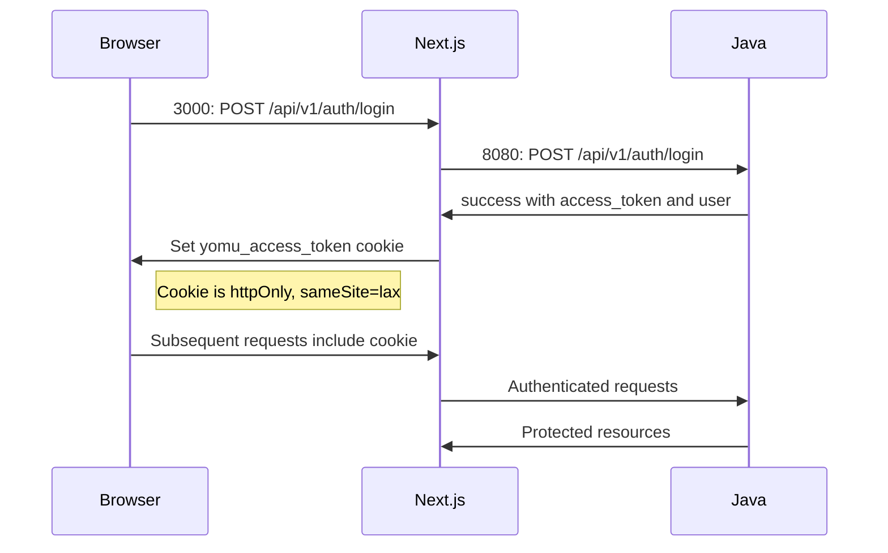
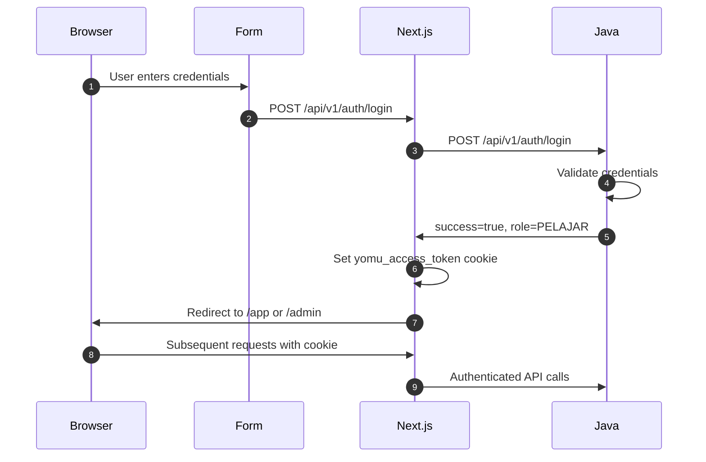

# BFF Pattern & Authentication

The frontend implements a Backend-for-Frontend (BFF) architectural pattern, where Next.js acts as an intermediary between the browser and the backend services (Java auth service on port 8080, Rust gamification service on port 8081).

## BFF Architecture

All API requests from the browser go through Next.js route handlers. This pattern provides:

- **Security**: Sensitive operations (like OAuth token handling) stay server-side
- **Aggregation**: Single request can fetch data from multiple backends
- **Validation**: Centralized response validation via `ApiResponse<T>`
- **Session Management**: HTTP-only cookies prevent token exposure



## Core Proxy Modules

### coreProxy.ts

Server-only module that provides the foundation for all API calls:

```typescript
// src/lib/server/coreProxy.ts
export async function coreFetch(path: string, init?: RequestInit) {
  const response = await fetch(`${CORE_API_BASE_URL}${path}`, init);
  return await response.json<ApiResponse<T>>();
}
```

**Key behaviors**:
- Calls `CORE_API_BASE_URL${path}` (env variable)
- Validates `ApiResponse<T>` response structure
- Returns parsed JSON with success/message/data fields

### cookies.ts

Manages authentication cookies:

- **Name**: `yomu_access_token`
- **Attributes**: `httpOnly`, `secure`, `sameSite=lax`, `path=/`
- **Purpose**: Store JWT tokens without JavaScript access

## Authentication Flow



## Auth API Functions

Location: `src/lib/api/auth.ts`

| Function | Description |
|----------|-------------|
| `login(email, password)` | Email/password authentication |
| `register(user)` | New user registration |
| `googleLogin(token)` | Google One Tap authentication |
| `me()` | Get current user (protected) |
| `logout()` | Clear cookie and session |

## Client Fetcher Pattern

Location: `src/lib/api/fetcher.ts`

```typescript
export async function apiFetch<T>(path: string, options?: RequestInit) {
  const response = await fetch(path, options);
  const data = await response.json<ApiResponse<T>>();
  
  if (!data.success) throw new Error(data.message);
  
  return data.data;
}
```

**Validation behavior**:
- Checks `data.success` field
- Throws on error with message from backend
- Returns `data.data` on success

## Google OAuth Integration

- **Provider**: GoogleOAuthProviderClient wraps Google login button
- **Configuration**: `CLIENT_ID` from.env via react-oauth-pkce
- **Button**: GoogleLoginButton component handles One Tap

## Protected Routes

Routes in `/app` and `/admin` check authentication on mount:

```typescript
'use client';

export default function ProtectedPage() {
  const { data: user, isLoading } = useQuery({ queryKey: ['me'], queryFn: me });
  
  if (isLoading) return <Loading />;
  if (!user) redirect('/auth/login'); // 401 redirect
  
  // Continue rendering...
}
```

## Role-Based Routing

| User Role | Redirect Target |
|-----------|-----------------|
| `ADMIN` | `/admin` |
| `PELAJAR` | `/app` |

## Route Handler Pattern

All `/api/v1/*` handlers follow this structure:

```typescript
// src/app/api/v1/auth/login/route.ts
export async function POST(request: Request): Promise<Response> {
  const body = await request.json();
  const response = await coreFetch('/api/v1/auth/login', {
    method: 'POST',
    body: JSON.stringify(body),
  });
  
  // Set cookie if login successful
  if (response.success && response.data.access_token) {
    // Set httpOnly cookie
    return NextResponse.json(response);
  }
  
  return NextResponse.json(response, { status: 401 });
}
```

**Guidelines**:
- Always return `ApiResponse<T>` structure
- Validate upstream response before processing
- Set cookies only on successful authentication
- Handle errors with appropriate HTTP status codes
