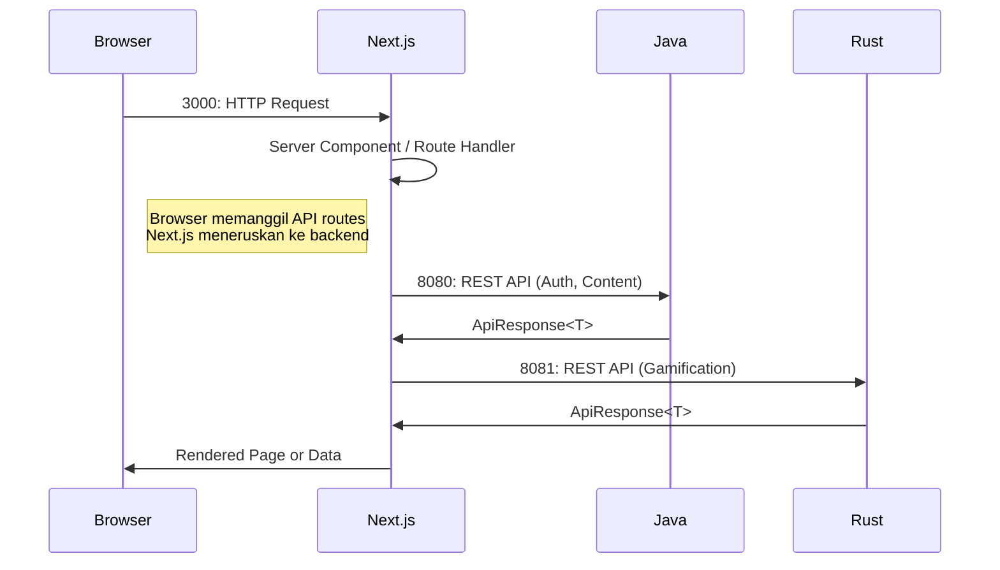

# Frontend

Frontend Yomu dibangun dengan Next.js 16.1.6 dan React 19.2.3, menggunakan TypeScript, Tailwind CSS v4, dan pustaka komponen shadcn/ui.

## Architecture

Frontend berkomunikasi langsung dengan backend services (Java di port 8080 untuk autentikasi dan konten, Rust di port 8081 untuk gamifikasi). Browser melakukan panggilan API langsung ke backend melalui route handler yang menangani autentikasi dan transformasi data.

## Teknologi

- **Framework**: Next.js 16.1.6
- **React**: 19.2.3
- **TypeScript**: Pengembangan type-safe
- **Styling**: Tailwind CSS v4 dengan CSS variables
- **Komponen UI**: shadcn/ui (55 komponen, gaya new-york)
- **Ikon**: lucide-react
- **Formulir**: React Hook Form + Zod v4
- **Autentikasi**: @react-oauth/google untuk Google OAuth
- **Notifikasi**: sonner
- **Mode Output**: Standalone (untuk build produksi yang dioptimalkan)

## Struktur Rute

| Rute | Deskripsi | Status |
|-------|-------------|--------|
| `/auth/*` | Halaman login dan registrasi | Sudah diimplementasikan |
| `/app` | Area pengguna terproteksi | Rute terproteksi |
| `/admin` | Dashboard admin | Rute terproteksi |
| `/bacaankuis/` | Pengalaman membaca + kuis | Sudah diimplementasikan |
| `/forums/` | Halaman diskusi | Sudah diimplementasikan |
| `/dashboard/clans` | Manajemen klan | Stub kosong |
| `/dashboard/missions` | Pelacakan misi | Stub kosong |
| `/dashboard/achievements` | Pameran pencapaian | Stub kosong |
| `/dashboard/leaderboard` | Tampilan leaderboard | Stub kosong |
| `/api/v1/*` | Route handler | Route handler |

## Dependensi Utama

- **shadcn/ui**: 55+ komponen siap pakai menggunakan gaya desain new-york
- **lucide-react**: Pustaka ikon
- **@react-oauth/google**: Integrasi Google OAuth
- **sonner**: Notifikasi toast
- **@hookform/resolvers**: Validasi Zod untuk formulir
- **zod**: Validasi skema

## Struktur Dokumentasi

- [`auth.mdx`](/docs/frontend/auth) — Architecture dan alur autentikasi
- [`components.mdx`](/docs/frontend/components) — Pustaka komponen UI dan komponen kustom
