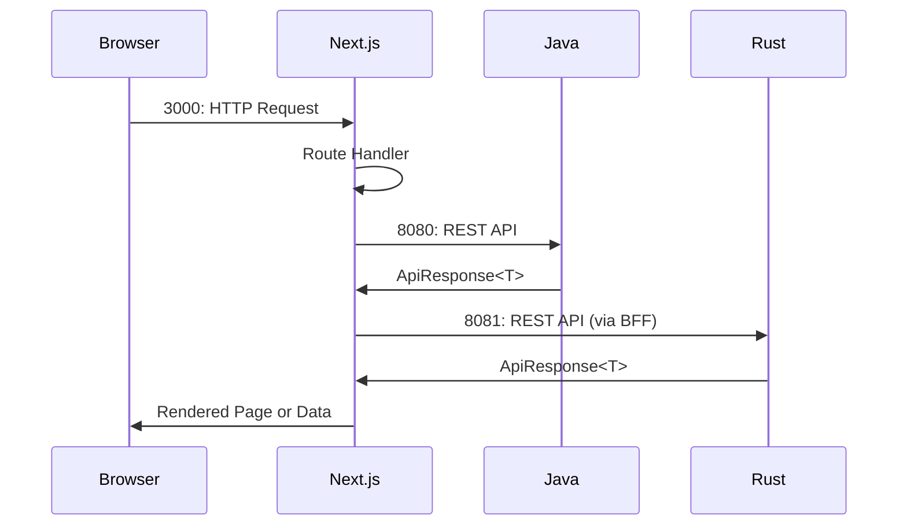

# Frontend

The Yomu frontend is built with Next.js 16.1.6 and React 19.2.3, utilizing TypeScript, Tailwind CSS v4, and the shadcn/ui component library.

## Architecture

The frontend follows a Backend-for-Frontend (BFF) pattern. All API calls go through Next.js route handlers, which act as proxies to the backend services. The browser never makes direct API calls to Java or Rust backends.

## Technology Stack

- **Framework**: Next.js 16.1.6
- **React**: 19.2.3
- **TypeScript**: Type-safe development
- **Styling**: Tailwind CSS v4 with CSS variables
- **UI Components**: shadcn/ui (55 components, new-york style)
- **Icons**: lucide-react
- **Forms**: React Hook Form + Zod v4
- **Authentication**: @react-oauth/google for Google OAuth
- **Notifications**: sonner
- **Output Mode**: Standalone (for optimized production builds)

## Route Structure

| Route | Description | Status |
|-------|-------------|--------|
| `/auth/*` | Login and register pages | Fully implemented |
| `/app` | Protected user area | Protected routes |
| `/admin` | Admin dashboard | Protected routes |
| `/bacaankuis/` | Reading + quiz experience | Fully implemented |
| `/forums/` | Discussion pages | Fully implemented |
| `/dashboard/clans` | Clan management | Empty stub |
| `/dashboard/missions` | Mission tracking | Empty stub |
| `/dashboard/achievements` | Achievement showcase | Empty stub |
| `/dashboard/leaderboard` | Leaderboard display | Empty stub |
| `/api/v1/*` | BFF proxy routes | Route handlers |

## Key Dependencies

- **shadcn/ui**: 55+ pre-built components using new-york design style
- **lucide-react**: Icon library
- **@react-oauth/google**: Google OAuth integration
- **sonner**: Toast notifications
- **@hookform/resolvers**: Zod validation for forms
- **zod**: Schema validation

## Documentation Structure

- [`bff-auth.mdx`](/docs/frontend/bff-auth) — BFF architecture and authentication flow
- [`components.mdx`](/docs/frontend/components) — UI component library and custom components
