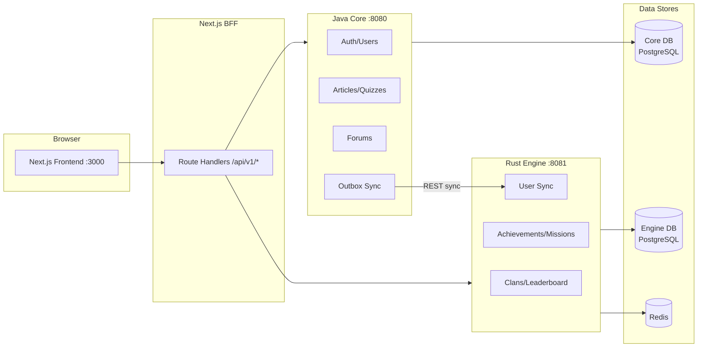

Selamat datang di dokumentasi resmi Yomu. Yomu adalah platform pembelajaran poliglot yang dirancang untuk meningkatkan literasi bahasa Indonesia melalui pengalaman membaca dan kuis yang digamifikasi.

## Navigasi Cepat

<Cards>
  <Card
    title="Architecture"
    description="Desain sistem, pattern komunikasi, skema database, dan deployment"
    href="/docs/architecture"
  />
  <Card
    title="Java Backend"
    description="Backend auth/user Spring Boot 4 dengan sinkronisasi outbox ke Rust"
    href="/docs/backend-java"
  />
  <Card
    title="Rust Backend"
    description="Engine gamifikasi Axum — klan, papan peringkat, pencapaian"
    href="/docs/backend-rust"
  />
</Cards>

<Cards>
  <Card
    title="Frontend"
    description="Next.js 16 dengan pattern BFF, shadcn/ui, dan Google OAuth"
    href="/docs/frontend"
  />
  <Card
    title="CI/CD Pipeline"
    description="Workflow GitHub Actions di ketiga subproyek"
    href="/docs/cicd"
  />
  <Card
    title="Keputusan Desain"
    description="Pilihan teknologi, analisis trade-off, dan pattern desain"
    href="/docs/design-decisions"
  />
</Cards>

<Cards>
  <Card
    title="Panduan Pengembangan"
    description="Instruksi setup, konfigurasi Docker, dan alur pengujian"
    href="/docs/development"
  />
  <Card
    title="Glosarium"
    description="Daftar istilah teknis dan domain-specific yang digunakan di Yomu"
    href="/docs/glosarium"
  />
</Cards>

## Architecture Sekilas

## Prinsip Utama

<Callout type="idea" title="No Shared State">
Java dan Rust masing-masing memiliki database sendiri. Tidak ada query lintas database — semua pertukaran data melalui REST API atau gRPC.
</Callout>

<Callout type="idea" title="Fault Tolerance">
Jika engine Rust mati, operasi Java (registrasi, pengiriman kuis) tetap berhasil. Sinkronisasi yang gagal diantrekan dan dicoba ulang.
</Callout>

<Callout type="idea" title="BFF Pattern">
Frontend Next.js tidak pernah memanggil backend secara langsung. Semua panggilan API mengalir melalui route handler sisi server yang mengelola cookie autentikasi.
</Callout>

## Tech Stack

| Lapisan | Teknologi | Versi |
|-------|-----------|---------|
| Frontend | Next.js + React | 16 / 19 |
| Java Backend | Spring Boot | 4.0.2 / Java 21 |
| Rust Backend | Axum | 0.8.8 / Rust 2024 |
| Database | PostgreSQL + Redis | 18 / 8 |
| CI/CD | GitHub Actions | — |
| Monitoring | Prometheus + Grafana + OpenTelemetry + Sentry + k6 | — |
| Deployment | GCP Compute Engine + GHCR + Blue-Green | — |
