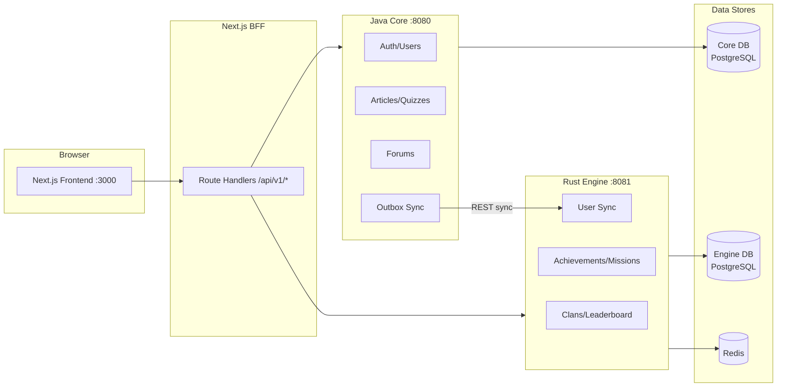

Welcome to the official Yomu documentation. Yomu is a polyglot learning platform designed to improve Indonesian literacy through gamified reading and quiz experiences.

## Quick Navigation

<Cards>
  <Card
    title="Architecture"
    description="System design, communication patterns, database schema, and deployment"
    href="/docs/architecture"
  />
  <Card
    title="Java Backend"
    description="Spring Boot 4 auth/user backend with outbox sync to Rust"
    href="/docs/backend-java"
  />
  <Card
    title="Rust Backend"
    description="Axum gamification engine — clans, leaderboards, achievements"
    href="/docs/backend-rust"
  />
</Cards>

<Cards>
  <Card
    title="Frontend"
    description="Next.js 16 with BFF pattern, shadcn/ui, and Google OAuth"
    href="/docs/frontend"
  />
  <Card
    title="CI/CD Pipeline"
    description="GitHub Actions workflows across all three subprojects"
    href="/docs/cicd"
  />
  <Card
    title="Design Decisions"
    description="Technology choices, trade-off analysis, and design patterns"
    href="/docs/design-decisions"
  />
</Cards>

<Cards>
  <Card
    title="Development Guide"
    description="Setup instructions, Docker configuration, and testing workflows"
    href="/docs/development"
  />
  <Card
    title="Glosarium"
    description="Daftar istilah teknis dan domain-specific yang digunakan di Yomu"
    href="/docs/glosarium"
  />
</Cards>

## Architecture at a Glance

## Key Principles

<Callout type="idea" title="No Shared State">
Java and Rust each own their database. No cross-database queries — all data exchange goes through REST APIs or gRPC.
</Callout>

<Callout type="idea" title="Fault Tolerance">
If the Rust engine is down, Java operations (registration, quiz submission) succeed regardless. Failed syncs are queued and retried.
</Callout>

<Callout type="idea" title="BFF Pattern">
The Next.js frontend never calls backends directly. All API calls flow through server-side route handlers that manage authentication cookies.
</Callout>

## Tech Stack

| Layer | Technology | Version |
|-------|-----------|---------|
| Frontend | Next.js + React | 16 / 19 |
| Java Backend | Spring Boot | 4.0.2 / Java 21 |
| Rust Backend | Axum | 0.8.8 / Rust 2024 |
| Databases | PostgreSQL + Redis | 18 / 8 |
| CI/CD | GitHub Actions | — |
| Monitoring | Prometheus + Grafana + OpenTelemetry + Sentry + k6 | — |
| Deployment | AWS EC2 + GHCR + Blue-Green | — |
